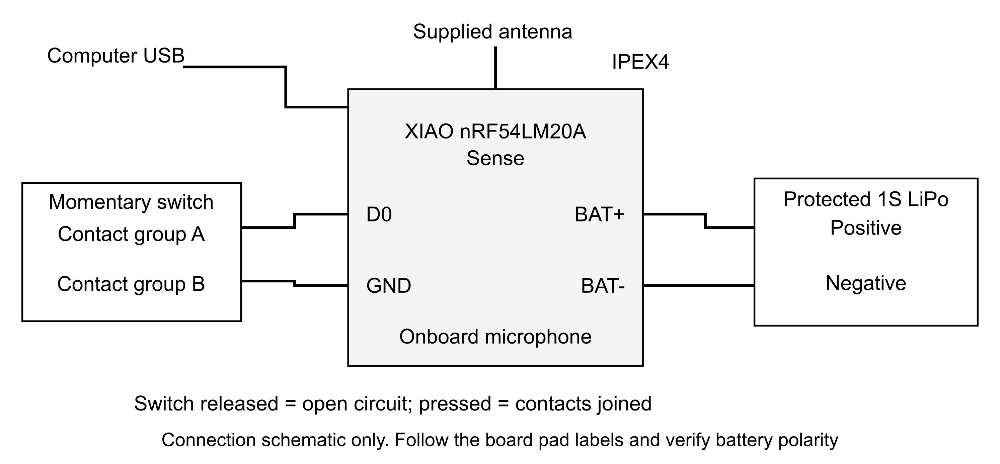

# Hermes Voice hardware workshop guide

Wiring, programming and testing the Seeed Studio XIAO nRF54LM20A Sense recorder with the Hermes Voice Android relay and Linux receiver. Version 0.3 | September 13 2026.

Use this guide at the workbench when your hardware arrives. Work through the stages in order and record the results. Begin with USB power and the battery disconnected. Successful compilation is preparation for these tests; it does not establish physical operation.

## Choose the correct software

The private delivery kit still contains the original v0.2 APK and firmware. Those files are preserved for reference. The diagnostics, recovery controls and review improvements in this guide require version 0.3 built from the updated source. A CI app marked CI test uses a separate package and is not your personal installation.

| Page | Workshop stage |
| --- | --- |
| 2 | Parts and wiring |
| 3 | Unpowered assembly and inspection |
| 4 | Prepare the Windows computer |
| 5 | Build personal version 0.3 |
| 6 | Program the recorder over USB |
| 7 | Prepare the Linux receiver |
| 8 | Install and pair the Android app |
| 9 | Test capture and delivery |
| 10 | Test interruptions and review transcripts |
| 11 | Commission the battery and enclosure |
| 12 | Troubleshooting and maintenance |
| 13 | Evaluate speech and record acceptance |
| 14 | References and build record |

## Record before starting

Board label and revision: ______________________________________________

Phone model and Android version: _______________________________________

Linux host and operating system: _________________________________________

Keep the private pairing card and signing-key backup secure. This guide contains no pairing code or bearer token. If you write credentials on paper, keep that copy private.

# Parts and wiring

Use the Sense board, a normally open momentary switch, the supplied antenna, a USB-C data cable, insulated wire, and a mating battery lead. The planned cell is the protected Adafruit 4237 3.7 V 350 mAh LiPo. Confirm the actual delivered labels and specifications before connecting it. [1, 3]



| Connection | Wire or connector | Check with all power removed |
| --- | --- | --- |
| Capture switch | D0 / P1.00 to contact group A | Released switch must be open circuit |
| Switch ground | GND to contact group B | Pressed switch must join the two groups |
| Battery positive | Mating lead positive to BAT+ | Verify actual connector polarity with a meter |
| Battery negative | Mating lead negative to BAT- / GND | Check continuity to GND |
| Antenna and USB | IPEX4 antenna and USB-C data cable | Use the matching connectors; never force them |

The schematic shows electrical connections, not the physical positions of pads. Use the board markings and the manufacturer's pinout. Never connect the switch to BAT+, 5V, RESET or microphone pins. The firmware uses an internal pull-up; no external pull-up is required.

Tools: temperature-controlled soldering iron, solder, wire cutters/strippers, magnification, insulation, and a multimeter. A suitable fused inline current instrument is needed later for battery measurements.

# Unpowered assembly and inspection

1. Photograph both sides of the board and its label. Confirm nRF54LM20A Sense. Compare the delivered revision with the official pinout and schematic before relying on pad positions. [1, 2]
2. Attach the supplied antenna carefully. Align the IPEX4 connector straight over its socket and press gently; do not bend or force it.
3. Before soldering, briefly connect only the board to the computer with a USB data cable. Confirm that its USB/debug interface is recognized. Disconnect USB again.
4. Identify the switch's two electrical contact groups with the continuity meter. Some legs of a four-leg tactile switch are permanently connected. Choose one leg from each separate group.
5. With USB and the battery disconnected, solder one switch wire to D0/P1.00 and the other to GND. Keep stripped conductor short and insulate joints.
6. Solder only the disconnected board-side battery pigtail: positive lead to BAT+ and negative lead to BAT-/GND. Do not solder directly to an energized cell or its pouch tabs.
7. Inspect for bridges, loose strands and damaged pads. Add strain relief so pulling a wire does not pull on a solder pad.
8. Meter the battery connector's actual polarity. Cable color and connector shape alone are not sufficient. Do not mate the battery yet.
9. Check the switch released and pressed, and check for an unintended short between supply and ground. A brief charging effect from capacitors is different from a persistent short; investigate uncertain readings.
10. Keep the assembly open and the battery disconnected for programming and initial capture tests.

## Unpowered inspection record

| Check | Pass or notes |
| --- | --- |
| Board and revision confirmed | ________________ |
| Switch open released and closed pressed | ________________ |
| No solder bridges or exposed strands | ________________ |
| Battery lead polarity verified | ________________ |
| Antenna seated and wiring strain relieved | ________________ |

Stop if the board, connector or cell differs from the specified parts. Do not improvise a different voltage, charger profile or board target.

# Prepare the Windows computer

Use PowerShell on your Windows computer. The project is under Desktop\CODEX-Projects\Hermes-Voice-Build-Kit; the Git repository is its source subfolder. These commands prepare software only and do not access a recorder.

```powershell
$Projects = Join-Path $env:USERPROFILE 'Desktop\CODEX-Projects'
$Kit = Join-Path $Projects 'Hermes-Voice-Build-Kit'
Set-Location (Join-Path $Kit 'source')
py -3.11 --version
git --version
java -version
```

Python 3.11 and Git are available on this computer. Target builds use JDK 17 as their baseline. If the tool check reports missing Java/Android tools, install those prerequisites and reopen PowerShell; do not change unrelated project settings.

## Prepare firmware tools

```powershell
py -3.11 -m venv .tools\pio
& .\.tools\pio\Scripts\python.exe -m pip install 'platformio==6.1.18'
& .\.tools\pio\Scripts\pio.exe pkg install --global --tool 'platformio/tool-openocd@~3.1200.0'
```

The first firmware build downloads the pinned Seeed board platform and its compiler packages. Internet access is required. Keep the exact board selection in firmware/platformio.ini.

## Prepare Android tools

Install Android Studio or its official SDK command-line tools. In SDK Manager install Android SDK Platform 36 and Build-Tools 35.0.0. Record the actual SDK directory. The example below uses Android Studio's usual Windows location; change it if yours differs. [5]

```powershell
$env:ANDROID_HOME = Join-Path $env:LOCALAPPDATA 'Android\Sdk'
py -3.11 tools/bootstrap_gradle.py
$env:GRADLE_BIN = (Resolve-Path '.tools\gradle-8.11.1\bin\gradle.bat').Path
py -3.11 tools/build_binaries.py --check
```

Expected: the checker finds the required tool paths. Missing prerequisites are a stop condition for building, not a reason to rename or substitute a firmware image. The check does not certify an offline cache or compile the app.

Actual SDK directory: ____________________________________________________

# Build personal version 0.3

Keep using the PowerShell session from page 4. Your personal app must retain its signing key, and your recorder firmware must retain its matching pairing header and card. The local files were restored from the original backup during this update. The commands below also document recovery after a future move or fresh checkout.

```powershell
$Backup = Join-Path $env:USERPROFILE 'Desktop\Hermes-Voice-PRIVATE-Keys-and-Pairing.zip'
py -3.11 tools/restore_identity.py --backup $Backup
py -3.11 tools/restore_identity.py --backup $Backup --apply
```

The first command previews. The second restores only the original app key and recorder pairing pair after checksum checks. Matching files remain unchanged; different existing identities cause a refusal. Keep a second secure copy of the private backup. Never upload these files to GitHub.

## Build both targets

```powershell
Remove-Item Env:HVB_CI_BUILD -ErrorAction SilentlyContinue
py -3.11 tools/build_binaries.py --target all
```

This can take several minutes and downloads missing dependencies. It creates a new timestamped folder under source/dist and compiler logs under source/build-logs. It does not flash hardware, install the phone app or start the receiver. Stop on a compiler, lint, signature or generated-configuration error.

| File in the successful build folder | Purpose |
| --- | --- |
| Hermes-Voice-0.3.0-test.apk | Personal Android app using the retained key |
| Hermes-Voice-XIAO-nRF54LM20A-Sense.hex | Preferred recorder image for the uploader |
| generated-zephyr.dts and generated-zephyr.config | Effective board and charger configuration |
| PRIVATE-pairing-card.txt | Pairing card matching that firmware |
| build-result.json and SHA256SUMS.txt | Completion record and file integrity checks |

Use the exact successful folder printed by the builder. Its build-result.json must say complete: true and hardware_tested: false. Do not mix files from different timestamp folders or use the isolated CI app as a personal update.

```powershell
$Bundle = Read-Host 'Paste the full successful dist folder path'
py -3.11 tools/flash_prebuilt.py --bundle $Bundle
```

Expected: image hashes and generated DTS/Kconfig checks pass, followed by CHECK ONLY. This command is safe without a board attached. Record the folder on page 14.

# Program the recorder over USB

Programming means writing the compiled firmware into the board. Keep the LiPo disconnected. Use the successful version 0.3 bundle from page 5. Do not use the original kit's fixed v0.2 upload command for a new v0.3 build.

1. Confirm the board is XIAO nRF54LM20A Sense and the antenna is attached. Disconnect other debug probes so there is only one intended target.
2. Connect a known USB-C data cable directly to the computer. A charge-only cable cannot program the board. Follow the manufacturer's normal USB/CMSIS-DAP driver setup if Windows does not recognize it. [1]
3. Preserve wanted recordings and any previous board firmware data before flashing. The application uses external flash for its own recording and settings partitions.
4. Run the check-only command again. A hash or generated-configuration failure must be resolved before writing.
5. Run the explicit flash command below. Read its displayed target and image path, then type the requested confirmation only if they match your board and selected bundle.
6. Keep the cable connected until programming, verify_image and reset finish. Stop on any error; do not switch to a different board target or a guessed mass-erase command.
7. After success, begin the USB-only tests on page 9. A successful image verification establishes that the programmer accepted the image, not that microphone, Bluetooth or charging works.

```powershell
py -3.11 tools/flash_prebuilt.py --bundle $Bundle
py -3.11 tools/flash_prebuilt.py --bundle $Bundle --flash
```

The interactive confirmation is: FLASH XIAO nRF54LM20A SENSE

The helper disables the vendor's automatic mass-erase recovery hook before connecting. If the device is locked or unrecognized, diagnose it deliberately. Do not drag a HEX onto an assumed USB drive, flash a ZIP, or rename a BIN to HEX/UF2.

| Programming check | Result |
| --- | --- |
| Correct board and antenna | ________________ |
| Battery disconnected | ________________ |
| Bundle integrity and configuration passed | ________________ |
| Programming and image verification passed | ________________ |
| USB-only startup behavior recorded | ________________ |

# Prepare the Linux receiver

Run this stage on the Linux computer that hosts Hermes, as its normal user. These are Linux shell commands, not PowerShell commands. The receiver is not installed or started by the Windows build. Keep delivery_mode set to review.

1. Verify Python 3.10+, Git, a C/C++ compiler, CMake, Tailscale and the intended Hermes installation. Use your Linux distribution's normal package manager for missing tools. Do not run the receiver as root.
2. Obtain the updated source on that host. If a checkout already exists, inspect its local changes before updating it. The clone command below is for a new directory.
3. Install receiver files and prepare Whisper using the source scripts. The installer preserves an existing config/token and does not start either service. The Whisper preparation script needs Internet and refuses to overwrite an existing Whisper directory.
4. Edit ~/.config/hermes-voice/config.json. Set actual absolute paths for whisper_executable, whisper_model and hermes_executable. Set the intended Hermes working directory. Confirm the CLI supports hermes chat --query-file.
5. Choose the network setup described below, then run the configuration check and start only the receiver. Start the worker in review mode after a test upload succeeds.

```bash
git clone https://github.com/EdgarAllenPoe/hermes-voice-build.git
cd hermes-voice-build
bash receiver/install-user.sh
bash tools/prepare-whisper.sh
cd ~/.local/share/hermes-voice/receiver
python3 -m hvbridge --config ~/.config/hermes-voice/config.json check
systemctl --user enable --now hermes-voice-receiver.service
```

## Select the private endpoint

For the existing direct HTTP preset, confirm the host's actual Tailscale IPv4 using tailscale ip -4. Set bind to that address and port to 8765; enter http://THAT-ADDRESS:8765/v1/voice in the app. The prefilled 100.99.200.55 address must match your host. Keep Tailscale running on both devices.

For HTTPS, bind the receiver to 127.0.0.1 and configure Tailscale Serve after checking tailscale serve status for existing routes. Follow source/docs/04-server.md. Do not overwrite an existing Serve route or expose the receiver publicly. [6]

The bearer token is the content of ~/.config/hermes-voice/token. Transfer it privately to the phone; never put it in a URL, Git commit, screenshot or this public manual. A Bluetooth passkey cannot substitute for it.

Chosen endpoint: ________________________________________________________

# Install and pair the Android app

1. Copy the personal Hermes-Voice-0.3.0-test.apk from the successful build folder to your Android phone. Open it and approve installation from that specific file-opening app when Android asks.
2. If an older personal app is installed, update it using the same signing key. Do not uninstall an app holding undelivered recordings to resolve a signature mismatch. Restore the matching key and rebuild instead. [4]
3. Open Hermes Voice. Grant Nearby devices/Bluetooth permissions and notification permission. The recorder uses its own microphone; the app does not request phone microphone access.
4. Enter the correct private receiver endpoint and bearer token, then tap Save server settings. Leaving the token field blank preserves an already stored token.
5. Tap Test server connection. Expect Server reachable and token accepted. This sends a health check and does not invoke Hermes. Fix the endpoint, token or Tailscale connection before continuing.
6. Power the recorder from USB with its antenna attached and the battery disconnected. Hold its capture button for about 1.5 seconds, then release; this opens a 60-second pairing window.
7. Tap Pair voice button and select the recorder. Complete Android's association prompt and the separate Bluetooth pairing prompt using the matching private pairing card.
8. Tap Start relay. Use Refresh status to inspect the connection and recorder information. The current firmware should report version 0.3.0 when it connects.
9. Unlock once after a phone reboot. Keep Bluetooth and Tailscale enabled. If you explicitly Force stop the app, reopen it and start the relay again; the app cannot bypass Android's force-stop rules.

## Recorder controls

| Action | Expected behavior |
| --- | --- |
| Single click while idle | No stored recording; tentative microphone activity expires |
| Double click and speak | Start recording, including available pre-roll |
| Single click while recording | Finish and save; an empty capture is cancelled |
| About 1.2 seconds of silence after detected speech | Automatic finish under the simple energy gate |
| Continuous speech or noise | Stop at the 60-second maximum |
| Hold about 10 seconds while idle | Forget phone bond; recordings remain |

One short vibration means the phone saved a recording. Two short vibrations mean the computer accepted it. Neither means that Hermes completed an action.

Pairing completed and app version checked: _________________________________

# Test capture and delivery

Use USB power with the battery disconnected. Keep the Linux worker in review mode. Use harmless phrases such as Remember to bring my notebook. Record both successful and failed attempts; do not mark a row passed from an LED alone.

| No | Test and expected result | Pass or notes |
| --- | --- | --- |
| 1 | Single idle click produces no saved or uploaded message. | ____________ |
| 2 | Double click, speak immediately, then stop. The first and final words are audible. | ____________ |
| 3 | Try a quiet phrase and a normal-volume phrase. Listen to both decoded files. | ____________ |
| 4 | Pause naturally within a thought. Record whether the 1.2-second silence gate cuts it short. | ____________ |
| 5 | Record without speaking for five seconds. Check that no unwanted message is kept. | ____________ |
| 6 | Speak continuously. Recording stops by the 60-second limit. | ____________ |
| 7 | Use manual stop before the limit. The recording validates and contains the intended words. | ____________ |
| 8 | Disconnect the phone and record three messages. They remain on the recorder. | ____________ |
| 9 | Reconnect the phone. All three transfer; the phone queue reflects their progress. | ____________ |
| 10 | Inspect diagnostics. Record microphone, audio, edge-drop, flash and quarantine counts. | ____________ |
| 11 | Complete 50 to 100 captures, including quick clicks and ordinary pauses. | ____________ |
| 12 | Confirm the receiver holds transcripts for review and no Hermes command ran automatically. | ____________ |

## Listen to the actual recording

On the Linux receiver, find an ID with status, then export that recording to a private WAV file. Replace MESSAGE_UUID with the exact ID. Use headphones or a local audio player; compare the first word, final word and pauses with what you said.

```bash
cd ~/.local/share/hermes-voice/receiver
python3 -m hvbridge --config ~/.config/hermes-voice/config.json status
python3 -m hvbridge --config ~/.config/hermes-voice/config.json export MESSAGE_UUID ~/voice-check.wav
```

Start the worker only after confirming receipt and review mode:

```bash
systemctl --user enable --now hermes-voice-worker.service
```

Captures attempted: ______  Complete recordings: ______  Missing/truncated: ______

Observed first-word delay or clipping: ______________________________________

# Test interruptions and review transcripts

Use software disconnections and harmless recordings. Do not simulate failures by shorting a battery or disconnecting unsafe live bench wiring.

| Recovery test and expected result | Pass or notes |
| --- | --- |
| Turn Bluetooth off during a transfer; turn it on again. The recording resumes or restarts and is saved once. | ________________ |
| Stop the receiver or disable Tailscale. Phone audio remains queued; delivery resumes after recovery. | ________________ |
| Temporarily enter a wrong token. Upload is rejected and recordings stay on the phone; restore the correct token. | ________________ |
| Keep the phone locked and idle for at least 30 minutes. Then make a recording and check actual delivery behavior. | ________________ |
| Reboot the phone, unlock once, then lock it again. Confirm relay recovery. | ________________ |
| With the phone absent, fill all 15 recorder slots. A further capture must not overwrite committed audio. | ________________ |
| Reconnect after the full-queue test. Confirm delivery and eventual slot reclamation. | ________________ |

## Inspect and correct before approval

The receiver's show command displays the transcript and state. To correct text, write the desired wording into a private UTF-8 text file, then use edit. The original transcript is retained. Choose approve OR reject for the specific message.

```bash
python3 -m hvbridge --config ~/.config/hermes-voice/config.json show MESSAGE_UUID
python3 -m hvbridge --config ~/.config/hermes-voice/config.json edit MESSAGE_UUID --transcript-file ~/corrected.txt
python3 -m hvbridge --config ~/.config/hermes-voice/config.json approve MESSAGE_UUID
# Alternative to approval:
python3 -m hvbridge --config ~/.config/hermes-voice/config.json reject MESSAGE_UUID
```

Approval permits Hermes execution when the worker runs. Rejection keeps the receipt and audio until deliberate cleanup. Keep review mode enabled while commissioning.

If a message becomes uncertain, Hermes may already have acted before an interruption. Inspect its history and the message's private hermes.log before considering an explicitly allowed retry. Duplicate audio receipts cannot guarantee exactly-once external actions.

Locked-phone result and recovery notes: ____________________________________

# Commission the battery and enclosure

Complete USB-only capture and transfer testing first. Before attaching a cell, verify that the selected bundle's generated DTS/Kconfig checks passed for 100 mA charging and 4.20 V termination. These are configuration values; the following supervised measurements establish physical behavior. [2, 3]

1. Confirm a protected ordinary 1S 3.7 V LiPo, the intended capacity and the supplier's charge limits. Do not substitute a 4.35 V high-voltage cell, LiFePO4, multi-cell pack or unprotected cell.
2. With USB removed, verify connector polarity again and connect the cell through the insulated mating lead. Keep the enclosure open and the pouch free of pressure or sharp edges.
3. Check battery-only startup, idle, capture and BLE transfer. If operation is unstable, disconnect safely and investigate before charging.
4. For charging, use a suitable inline instrument in the battery lead. A USB input meter also measures board power and does not by itself show cell charging current.
5. Use the meter's correct fused current input and range. Never place a meter in current mode directly across a battery. If unfamiliar with current measurement, get experienced help with the instrument setup.
6. Connect USB and supervise the charge. Measure cell current and voltage; check taper and termination against the cell specification. Stop on swelling, odor, unusual heat or unexpected readings.
7. Test ordinary USB insertion/removal after stable operation. Do not deliberately deep-discharge, short or overcharge the cell.
8. Fit the enclosure only after the electrical tests pass. Provide wire strain relief, clearance around the pouch, an unobstructed microphone opening and room for the antenna. Recheck audio and radio performance with the lid fitted.

The referenced board schematic uses a fixed NTC resistor and the selected cell has no temperature lead. It does not measure actual cell temperature. Use attended charging in a suitable indoor location; do not treat this as a finished temperature-protected consumer charger. [2, 3]

| Measurement | Measured result |
| --- | --- |
| Cell voltage before test | ________ V |
| Battery-only idle current | ________ mA |
| Capture and BLE transfer current | ________ mA |
| Cell charging current at low/mid charge | ________ mA |
| Charge termination voltage | ________ V |
| Temperature rise or instability | ________________ |
| Enclosure audio/range recheck | ________________ |

# Troubleshooting and maintenance

| Symptom | Check first | Preserve |
| --- | --- | --- |
| Board not recognized | USB data cable, exact board, normal CMSIS-DAP driver setup | Do not substitute a target or auto-erase |
| Red recorder LED | Free slots, microphone/audio counters, flash errors | Keep wanted recordings before recovery |
| Cannot pair | 1.5-second hold and release, 60-second window, correct card | Pairing passkey is not server token |
| Phone cannot upload | Test server connection, Tailscale, URL/token | Pending audio stays on phone |
| Held phone messages | HTTP reason and server configuration; use Review held uploads | Held audio remains until accepted |
| Quarantined recorder slots | Inspect diagnostic count and preserve device state | No automatic erase; capacity is reduced |
| Missing first word | Compare exported WAV and click timing | Keep examples for microphone tuning |
| Receiver uncertain | Inspect Hermes history and private execution log | Do not automatically repeat an action |

## Export diagnostics

Tap Export diagnostics in the app and choose a file location. The report contains version, connection, progress and numeric recorder counters. It excludes tokens, endpoint, Bluetooth address, transcripts and audio. Record the time of the failure separately; recorder counters reset on reboot.

## Inspect and clean completed receiver work

Check storage usage, then preview cleanup. Only old done/rejected work is eligible. Applying removes known working files and clears their database content while preserving UUID/hash receipts. Stop the worker before applying; restart it afterward.

```bash
python3 -m hvbridge --config ~/.config/hermes-voice/config.json storage
python3 -m hvbridge --config ~/.config/hermes-voice/config.json cleanup --older-than-days 7
systemctl --user stop hermes-voice-worker.service
python3 -m hvbridge --config ~/.config/hermes-voice/config.json cleanup --older-than-days 7 --apply
systemctl --user start hermes-voice-worker.service
```

Cleanup is not secure erasure of SQLite pages or backups and does not remove Hermes history. Back up the database consistently with both services stopped, or use SQLite's backup facility. Keep signing keys and the recorder pairing pair backed up separately.

# Evaluate speech and record acceptance

Before trusting automatic delivery, compare speech you actually use: normal and quiet ideas, names, dates, pauses and background noise. The public CI sample is a limited baseline; it does not establish accuracy for your voice or recorder microphone.

## Prepare a private speech comparison

1. Create an ignored speech-eval folder in the source checkout. Copy fixtures/speech-manifest.example.json into it as manifest.json.
2. Record short mono 16 kHz 16-bit PCM WAV files, each no longer than 60 seconds. Match each manifest wav filename and enter the exact words spoken. Use an empty reference for a no-speech sample.
3. Run the evaluator on a computer with your actual Whisper executable/model configured. Use a new output directory for each run. It never invokes Hermes.
4. Listen to original.wav and compressed.wav for each case, then inspect report.json. Investigate changed names/dates, missing words and unexpected text from silence even when the overall error rate is low.

```bash
python3 tools/evaluate_speech.py speech-eval/manifest.json \
  --out speech-eval/run-001 \
  --whisper /absolute/path/to/whisper-cli \
  --model /absolute/path/to/ggml-small.bin
```

Omit --whisper and --model to prepare the audio comparison without transcription. Keep recordings, transcripts and reports private. The evaluator reports word error rate after ignoring case/punctuation and separately counts unexpected words for empty-reference cases.

## Acceptance record

| Requirement | Pass or remaining work |
| --- | --- |
| Correct hardware, wiring and polarity checked | ________________ |
| Personal APK and matching firmware recorded | ________________ |
| 50 to 100 USB-powered captures checked | ________________ |
| First and final words preserved | ________________ |
| Offline, reconnect and queue-full recovery checked | ________________ |
| Locked-phone and reboot behavior checked | ________________ |
| Battery charge and enclosure checks completed | ________________ |
| Speech quality and intended notes destination accepted | ________________ |

Accepted for ordinary use by: __________________  Date: _____________________

Keep delivery_mode as review until the results justify changing it. Record limitations and repeat affected tests after firmware, app, model, phone OS or enclosure changes.

Remaining work: _________________________________________________________

# References and build record

The wiring and programming instructions combine the project configuration with the primary references below. Verify the actual board revision and cell specifications. Manufacturer examples do not certify this custom assembly.

[1] Seeed exact board pinout and programming
https://wiki.seeedstudio.com/xiao_nrf54lm20a_getting_started/

[2] Seeed board schematic
https://files.seeedstudio.com/wiki/XIAO_nRF54LM20A/getting_start/RES/XIAO_nRF54LM20A_Schematic.pdf

[3] Adafruit protected 350 mAh cell
https://www.adafruit.com/product/4237

[4] Android app signing and update identity
https://developer.android.com/studio/publish/app-signing

[5] Android SDK Manager
https://developer.android.com/studio/intro/update#sdk-manager

[6] Tailscale Serve reference
https://tailscale.com/docs/reference/tailscale-cli/serve

Additional implementation references and source links are in source/SOURCES.md. Detailed protocol and commissioning notes are in source/docs/05-protocol.md, 06-testing.md and 10-prehardware.md.

## Record the exact tested software

| Item | Record |
| --- | --- |
| Git commit or release | ________________________________________ |
| Successful dist folder | ________________________________________ |
| APK version and package | ________________________________________ |
| Firmware version | ________________________________________ |
| Pairing card backup location | ________________________________________ |
| Signing key backup location | ________________________________________ |
| Whisper version and model | ________________________________________ |
| Phone model and OS build | ________________________________________ |
| Board revision and cell model | ________________________________________ |

Do not write actual passkeys or tokens in a copy you intend to share. Keep original v0.2 delivery checksums with their original binaries; the new source and builds have their own records.

Next retest date or change that triggers retesting: ____________________________
